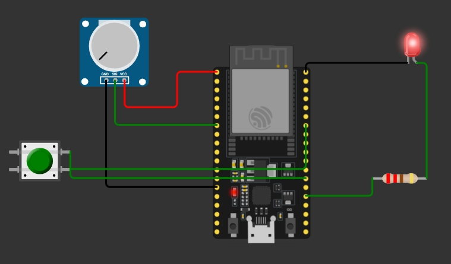
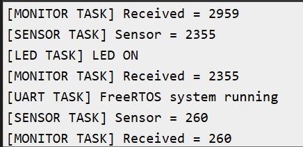

# RTOS-Based Multitasking System

## Overview

An RTOS-based embedded system project using ESP32 and FreeRTOS. The project demonstrates multitasking by running multiple tasks concurrently and coordinating them using FreeRTOS synchronization and communication mechanisms.

## Features

- Multiple concurrent FreeRTOS tasks
- Task scheduling and priority management
- Inter-task communication using queues
- Task synchronization using semaphores
- GPIO-based task control
- Serial monitoring for task activity
- Wokwi-based simulation and testing

## Technologies Used

- ESP32
- Embedded C
- FreeRTOS
- Tasks
- Queues
- Semaphores
- GPIO
- UART
- Wokwi
- Mutex 
- Event Groups

## Project Structure

| File | Description |
|---|---|
| `sketch.ino` | Main application and FreeRTOS task implementation |
| `diagram.json` | Wokwi circuit configuration |
| `wokwi-project.txt` | Wokwi project configuration |

## Tasks (7)
LED, Sensor, Monitor, Button, Event, System Status, UART

## Synchronization
- Queue: Sensor task sends data to Monitor task
- Mutex: protects shared Serial output
- Event Group: button press signals the Event task

## Pins
- LED: GPIO 2
- Button: GPIO 4

Note: sensor values are simulated using random().

## RTOS Concepts Demonstrated

### Tasks

Independent tasks are created to perform different operations concurrently.

### Queues

Queues are used for communication between tasks and for passing data safely between concurrent operations.

### Semaphores

Semaphores are used to synchronize access to shared resources and coordinate task execution.

## Simulation

The project was developed and tested using the Wokwi online simulator.

The simulation demonstrates FreeRTOS multitasking and task communication without requiring physical hardware.
### Wokwi Circuit

### Simulation Output

## Learning Outcomes

- Understanding of RTOS fundamentals
- FreeRTOS task creation and scheduling
- Task priorities and multitasking
- Inter-task communication
- Synchronization using semaphores
- Embedded firmware debugging using simulation

## Author

**Sakshi**

Electronics and Communication Engineering
